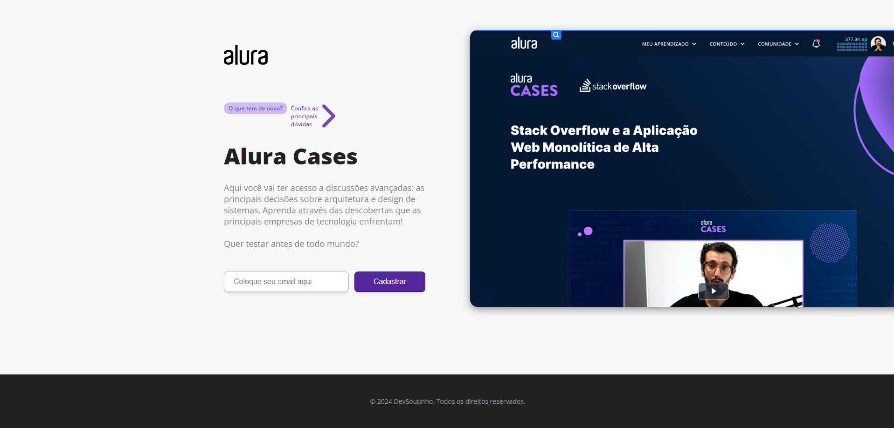
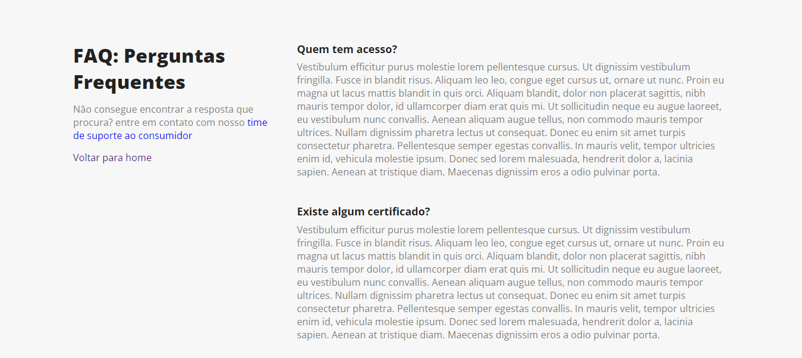

# Projeto Alura-Cases-Divulgação

Projeto desenvolvido durante o curso de NextJs: explorando o framework

# Principais tecnologias utilizadas no projeto

* NextJs
* NodeJs
* FontAwesome

# Imagens do projeto

Pagina inicial

Pagina de FAQ